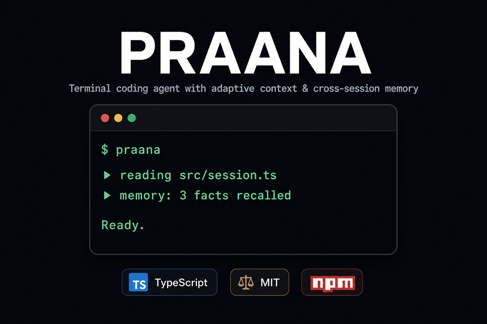

# PRAANA

[](https://www.npmjs.com/package/praana)
[](https://github.com/amitkumardubey/praana)
[](https://amitkumardubey.github.io/praana/)

**A terminal coding agent that manages context like memory, within a session and across sessions.**

<p align="center">
  
</p>

Long sessions fill up fast. The prompt accumulates stale tool output and repeated context; the model loses track. Come back the next day and you re-explain everything from scratch.

PRAANA compiles a fresh prompt on every turn: tiered working memory, tool-output distillation, a session checkpoint. The full transcript never goes in. At `/exit`, a summariser extracts learnings from the transcript and writes them to a local SQLite database. Start the next session in the same repo and you get a ranked digest back.

Runs on Bun. One binary, pure TypeScript, local-first, any provider.

> **Status:** v0.9.0 <!-- x-release-please-version --> — experimental. The context engine and memory are ideas we're proving in real use, not solved problems. We publish [known limitations](#known-limitations-honest) and make no benchmark claims we can't back.

> **How it was built:** vibecoded. Written by coding agents with human direction and review.

**Three problems it solves:**

- **Sessions that drift:** PRAANA summarises tool output (diffs, test results, type errors, search results) before it reaches the prompt. The agent stays sharp as the session grows.
- **Cold starts every day:** Record a decision once and PRAANA surfaces it in a ranked digest the next time you open the same project. No re-explaining your stack or conventions.
- **Terminal noise choking context:** Run `git diff` on 200 files or hit 50 test failures. The agent gets a focused summary. Full output stays stored and fetchable if it needs to dig in.

---

## Quick Start

### Install (recommended)

```bash
# Install globally
bun add -g praana

# Or run without installing
bunx praana
```

Set up your API key and launch:

```bash
# Set any provider API key (PRAANA auto-detects which one)
export ANTHROPIC_API_KEY="sk-ant-..."       # or
export OPENAI_API_KEY="sk-..."              # or
export OPENROUTER_API_KEY="sk-or-v1-..."    # or many others

# Launch the agent
praana
```

> **First time?** PRAANA auto-detects your provider from the environment. If no key is found, it runs an interactive setup wizard (TTY) or shows clear instructions.
> Default UI is the custom terminal chat shell when stdout is a TTY (`[ui] mode = "tui"`); use `praana --ui readline` for the classic line interface.
> Requires **Bun ≥ 1.2**. Install at [bun.sh/install](https://bun.sh/install).

### Global CLI alias

After installing with `bun add -g praana`, both `praana` and `pran` are on your PATH. If Bun's global bin is not in your PATH, add it:

```bash
export PATH="$HOME/.bun/bin:$PATH"
praana    # or the short alias: pran
```

### Build from source (for development)

```bash
git clone https://github.com/amitkumardubey/praana.git
cd praana
bun install

# Create a config file (auto-detects provider from environment)
bun src/main.ts init

# Set your API key and launch
export ANTHROPIC_API_KEY="sk-ant-..."
bun src/main.ts
```

### Configuration

PRAANA auto-detects provider API keys from the environment. No config file is needed to get started.

If you want to customize settings, create a config file:

```bash
praana init   # Creates praana.config.toml with detected provider
```

See [`praana.config.example.toml`](./praana.config.example.toml) for all available settings.

#### Supported Providers

| Provider | Environment Variable |
|---|---|
| Anthropic | `ANTHROPIC_API_KEY` |
| OpenAI | `OPENAI_API_KEY` |
| DeepSeek | `DEEPSEEK_API_KEY` |
| Groq | `GROQ_API_KEY` |
| Google | `GOOGLE_GENERATIVE_AI_API_KEY` |
| Mistral | `MISTRAL_API_KEY` |
| xAI | `XAI_API_KEY` |
| Fireworks | `FIREWORKS_API_KEY` |
| Together | `TOGETHER_API_KEY` |
| OpenCode | `OPENCODE_API_KEY` |
| OpenRouter | `OPENROUTER_API_KEY` |
| Ollama | *(local, no key needed)* |

Provider resolution precedence:
1. Explicit config file setting
2. Environment-detected key (in the order above)
3. Interactive setup (TTY) or clear instructions (non-TTY)

---

## Why PRAANA vs a plain transcript agent?

| | Typical transcript agent | PRAANA |
|---|--------------------------|--------|
| **Long sessions** | Full history in the prompt; context window fills up | **Engine mode**: PRAANA summarises tool output and trims stale context every turn. Long sessions stay coherent. |
| **Next session** | Starts cold unless you paste notes | **Cognitive memory**: at `/exit`, PRAANA extracts what you decided and learned. Start tomorrow in the same repo and it surfaces without re-explaining. |
| **Skills** | Manual or always-on | Engine mode: BM25-ranked `SKILL.md` residency (hot / warm / cold) |
| **Claims** | Often marketed as solved | [Known limitations](#known-limitations-honest) published upfront. No benchmark claims we can't back. |

**Example workflow:** On day 1, `decide` records "use Vitest, in-memory SQLite in tests." Start a new session the next day in the same repo and `/digest` surfaces it without re-explaining. Engine mode stubs yesterday's task graph instead of replaying every tool result.

---

## What it does

**Concrete differences from a standard transcript agent:**

1. Per-turn deterministic compiler with per-section token budgets.
2. Tiered working memory (`active` / `soft` / `hard`) with BM25 + substring auto-hydration before each turn.
3. **Automatic output compression:** when you run `git diff`, your test suite, or the type checker, the agent sees a focused summary. Full output stays stored and fetchable with `retrieve_artifact`. Built-in distillers cover git diffs, npm test output, TypeScript errors, ripgrep results, and generic logs.
4. Session resume by replay: O(1) state-graph checkpoint, then only post-checkpoint events replay.
5. Cross-session memory in local SQLite; at `/exit` a summariser extracts learnings, and the next session starts with a ranked digest.

**Two compile modes** (see `[context_engine] enabled` in config):

| Mode | Default? | Behaviour |
|---|---|---|
| **Classic** | Yes (`enabled = false`) | Full verbatim transcript in the prompt. Same general shape as many coding agents. |
| **Engine** | Opt-in | Tiered working memory, tool-output distillation, session checkpoint, scored prompt compilation, progressive skills. |

**Cognitive Memory** (optional, `[memory] enabled = true`):

- At `/exit`, a summariser extracts facts, decisions, patterns, mistakes, preferences, and constraints from the transcript.
- Next session starts with a ranked digest in the prompt.
- In project sessions, PRAANA queries both project and global scopes and merges the results (#56).

**Project context:** loads `AGENTS.md` / `CLAUDE.md` plus an optional stack fingerprint (`package.json`, `go.mod`, etc.) on session start.

**Skills:** in engine mode, discovers `SKILL.md` files and loads them by relevance; in classic mode, lists paths only.

Architecture details: [docs site](https://amitkumardubey.github.io/praana/) · [ARCHITECTURE.md](./docs/ARCHITECTURE.md) · [concepts.md](./docs/concepts.md)

---

## Known limitations (honest)

These are real gaps today—not a roadmap dressed up as marketing.

| Area | What's weak |
|---|---|
| **Memory recall** | Semantic recall uses `@huggingface/transformers` by default (`embedder = "auto"`); model weights download on first run. Ollama is an opt-in alternative. Global and project memories merge in project sessions, but near-duplicate or conflicting entries are not automatically reconciled. |
| **Context engine** | Off by default. Enabling it adds complexity; fallback to classic if init fails. |
| **Long sessions** | Tiering and distillation help but don't guarantee the model stays on track. |
| **Hydration** | Demoted state can be hidden until you mention it or the agent calls `hydrate`—the model doesn't always recover context proactively. |
| **Summariser** | Session-end learning needs a configured summariser and API access; can run in background on exit. |
| **Shell tool** | Optional path/command sandbox (`[shell]` in config); **off by default**. When disabled, runs with your user permissions. |
| **Comparison** | No published evals. We don't know if memory beats a plain transcript agent for your workflows. |

If Cognitive Memory doesn't help you after a few real projects, that's useful feedback—not a surprise.

---

## Slash commands

| Command | Purpose |
|---|---|
| `/help` | Full list |
| `/exit` | End session (runs summariser when memory is on) |
| `/clear`, `/new` | Reset working memory (engine state / checkpoint) |
| `/state` | Working-memory objects (engine mode) |
| `/digest` | Cognitive Memory digest |
| `/recall <query>` | Search Cognitive Memory |
| `/stats` | Session + memory stats |
| `/events` | Last 20 session log events |
| `/model [provider] <id>` | Switch model and optionally provider mid-session |
| `/sessions` | List sessions to resume |
| `/thinking <on\|off>` | Show or hide reasoning text |
| `/incognito <on\|off>` | Disable Cognitive Memory writes |
| `/debug` | Verbose tooling + saved prompts |
| `/why <id>` | Why a context unit was included (engine + debug) |

### `/model` syntax

Switch the active model on the current provider, or switch provider and model together:

```text
/model                          # show current provider/model
/model gpt-4o                     # model on current provider
/model openai gpt-4o            # switch to OpenAI native
/model opencode mimo-v2.5-free  # switch to OpenCode Zen
/model openrouter openai/gpt-4o # route via OpenRouter
```

Unknown ids are validated against the bundled pi-ai catalog first, then against the provider's live `/models` list (cached 6 hours at `~/.praana/provider-catalog-cache.json`). OpenAI-compatible providers with live catalogs: OpenRouter, OpenCode, OpenAI, DeepSeek, Groq, xAI, Fireworks, Together, and Ollama. Anthropic, Google, Mistral, and Bedrock still rely on the static pi-ai catalog.

---

## Development

```bash
bun dev
bun typecheck
bun test
```

### Docs site (Astro)

GitHub Pages is built from [`website/`](./website/) with [Astro](https://astro.build/). Markdown sources in [`docs/`](./docs/) are rendered at build time (no duplication).

```bash
cd website && bun install && bun dev    # http://localhost:4321/praana/
cd website && bun run build             # output → website/dist/
```

---

## What's next

See [ROADMAP.md](./ROADMAP.md). High level: making Cognitive Memory and the context engine actually pay off, semantic recall by default, and the measurement to tell honestly whether they help.

**Contributing:** [CONTRIBUTING.md](./CONTRIBUTING.md) · [good first issues](https://github.com/amitkumardubey/praana/issues?q=is%3Aissue+is%3Aopen+label%3A%22good+first+issue%22) · [Discussions](https://github.com/amitkumardubey/praana/discussions) (Q&A, ideas, releases)

Issues and PRs welcome.

---

## License

MIT — [LICENSE](./LICENSE). Version history: [CHANGELOG.md](./CHANGELOG.md) (auto-generated by release-please on each release).
