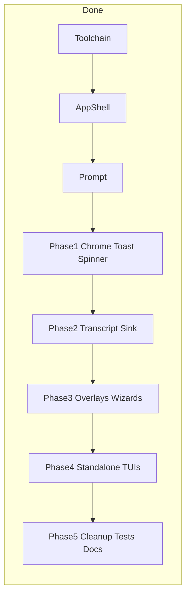

# Full Solid TUI migration — phase-wise plan

**Date:** 2026-08-04  
**Branch:** `feat/ad/opentui-solid`  
**Status:** Complete (Phases 0–5)  
**Related:** [OpenTUI migration design](./2026-08-03-opentui-migration-design.md)

## Summary

PRAANA’s interactive TUI runs on **`@opentui/solid`**. Imperative OpenTUI host classes for chrome, transcript, toast/spinner, and in-session overlays were retired. `TurnUiSink` / session / turn contracts are unchanged.

## Current state

| Area | Status |
|------|--------|
| `solid-js` + `@opentui/solid`, bun preload, `jsxImportSource` | Done |
| Solid App / Prompt / chrome / toast / spinner | Done |
| Solid transcript store + view + sink mount | Done |
| Solid overlays (slash / model / logout; login bridged) | Done |
| Solid download consent + setup wizard | Done |
| Legacy imperative hosts deleted | Done (Phase 5) |
| [`run.tsx`](../../src/ui/tui/run.tsx) | Thin session bridge |

**Still bridged (not deleted):** `login-wizard.ts` (mounted via `overlays/login-bridge.tsx`), `oauth-login-ui.ts` sink helpers.

**Note:** Prefer `position: absolute` overlays over OpenTUI `Portal` for in-app modals (Portal was unreliable in this migration).

---

## Phase 5 — Cleanup, tests, docs (complete)

**Goal:** Solid-only interactive TUI; docs/tests match.

**Done**

1. Deleted unused imperative modules (`inverted-editor`, toast-region, spinner class, chrome bars, model-selector class, logout-wizard class, slash/overlay helpers, transcript container + components).
2. Replaced obsolete unit tests with Solid-oriented suites (`tui-chrome` formatters, `overlay-state`, thin `tui-run` primitives).
3. Updated transcript benchmark to `createTranscriptStore`.
4. Docs: AGENTS / ARCHITECTURE / this migration note.

**Commit:** `chore(tui): retire imperative tui hosts and harden solid tests`

---

## Out of scope (unchanged)

- OpenCode-level keybind/config/extmarks/image-attachment product surface
- Headless `praana run` rewrite
- Adaptive Context / Cognitive Memory backend changes
- Full Solid rewrite of in-session `login-wizard.ts` (still bridged)
