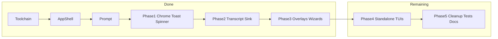

# Full Solid TUI migration — phase-wise plan

**Date:** 2026-08-04  
**Branch:** `feat/ad/opentui-solid`  
**Status:** Active  
**Related:** [OpenTUI migration design](./2026-08-03-opentui-migration-design.md)

## Summary

Finish migrating PRAANA’s interactive TUI from the current **hybrid** (Solid `App`/`Prompt` + imperative hosts for transcript/chrome/wizards) to a **fully Solid** shell on `@opentui/solid`, keeping OpenTUI’s Zig renderer and the `TurnUiSink` / session / turn contracts unchanged.

## Current state (done)

| Area | Status |
|------|--------|
| `solid-js` + `@opentui/solid`, bun preload, `jsxImportSource` | Done |
| Solid [`app.tsx`](../../src/ui/tui/app.tsx) shell | Done |
| Solid [`prompt/`](../../src/ui/tui/prompt/) — grow, history, paste collapse, autocomplete | Done |
| Solid chrome / toast / spinner via [`shell-ui.ts`](../../src/ui/tui/shell-ui.ts) | Done (Phase 1) |
| Solid transcript + store + sink mount | Done (Phase 2) |
| Solid overlays (slash / model / logout + login bridge) | Done (Phase 3) |
| [`run.tsx`](../../src/ui/tui/run.tsx) bridge | Thin — session wiring only |

**Still imperative:** login wizard body (bridged into Solid frame), setup wizard, download consent, oauth-login UI; legacy overlay/selector/transcript container classes unused by live path but present.

**Note:** OpenTUI `Portal` was unreliable for overlays in this spike; overlays use `position: absolute` on the app root instead (same approach as the Prompt autocomplete popup).

**Invariant:** no changes to `turn.ts` / `session.ts` / `TurnUiSink` method contracts. Pure helpers (formatters, projection, theme) may stay plain TS.

---

## Phase 0 — Baseline (complete)

Solid toolchain, Prompt module, hybrid `run.tsx`.

**Exit:** `bun typecheck` clean; Prompt smoke via interminai.

---

## Phase 1 — Chrome, toast, spinner (complete)

**Goal:** Remove imperative chrome/toast/spinner construction from `run.tsx` `onReady`.

| Target | Solid path |
|--------|--------|
| Identity / glance | `chrome/bars.tsx` + `shell-ui` chrome API |
| Formatters (keep pure) | `chrome/glance-format.ts` |
| Toasts | `toast-host.tsx` + `ui.toast` |
| Spinner | `spinner-host.tsx` + `ui.spinner` |

**Done**

1. Solid `IdentityBar` / `GlanceBar` driven by `createShellUi()` signals.
2. `ToastHost` + `SpinnerHost` in `App`.
3. Bridge: `ui.chrome.setStatus` / `ui.toast` / `ui.spinner` — no imperative class construction in `run.tsx`.

**Exit**

- No IdentityBar/GlanceBar/ToastRegion/Spinner class construction in `run.tsx`.
- Interminai: chrome updates after `/stats`; toast on slash feedback; spinner during a turn.

**Commit:** `feat(tui): solid chrome toast spinner`

---

## Phase 2 — Transcript + sink (complete)

**Goal:** Transcript is a Solid tree; sink mutates Solid stores, not `BoxRenderable.add`.

| Target | Solid path |
|--------|--------|
| Store / mount | `transcript/store.ts`, `transcript/mount.ts` |
| Scroll view + entries | `transcript/view.tsx`, `transcript/entries.tsx` |
| Sink | `sink.ts` → `TranscriptMount` (no RenderContext) |
| Keep pure TS | `projection.ts`, `model.ts`, events/gap/opts |

**Done**

1. Solid store: ordered entries + streaming id set + focus selection.
2. Components: user, assistant (`markdown`), tool row, thinking, system, recall, turn footer.
3. `scrollbox` sticky-bottom; F9 focus via store + key handlers.
4. `OpenTuiSink` drives `TranscriptMount` (same TurnUiSink methods).
5. Resume: `loadIndex` into store from bootstrap.
6. Unit tests: `tests/transcript-store.test.ts`.

**Exit**

- Chat turn rows render (user / system / tools / footer); LLM stream path unchanged.
- Resume loads bootstrap into store.
- Interminai: `/shell` and error/footer rows visible; F9 focuses transcript.

**Commit:** `feat(tui): solid transcript and sink`

---

## Phase 3 — In-session overlays and wizards (complete)

**Goal:** Model selector, login/logout, slash-result are Solid; Prompt focus restores cleanly.

| Target | Solid path |
|--------|--------|
| Overlay state | `overlays/state.ts` |
| Frame / host | `overlays/frame.tsx`, `overlays/host.tsx` (absolute z-index, not Portal) |
| Slash result | `overlays/slash-result.tsx` |
| Model selector | `overlays/model-selector.tsx` |
| Logout | `overlays/logout.tsx` |
| Login | `overlays/login-bridge.tsx` mounts imperative `LoginWizard` (full Solid rewrite deferred) |

**Done**

1. App overlay signal: `none | model | login | logout | slash`.
2. Esc/any-key dismiss → `overlay.dismiss()` + `prompt.focus()`.
3. Removed imperative `overlaySlot` / `clearSlot` from `run.tsx`.
4. Overlays paint above chrome via absolute host (Portal skipped — unreliable here).

**Exit**

- `/model`, `/help` open/close under interminai; Prompt accepts keys after.
- Login remains bridged; logout is Solid.

**Commit:** `feat(tui): solid overlays and wizards`

---

## Phase 4 — Standalone pre-session TUIs

**Goal:** Setup and consent use `render(() => …)` only.

| Target | Today |
|--------|--------|
| Setup wizard | `setup-wizard.ts` (~900 lines — multi-commit OK) |
| Download consent | `download-consent.ts` |
| OAuth helper | `oauth-login-ui.ts` |

**Work**

1. Step machine as Solid signals (provider → auth → model → confirm).
2. Shared Solid primitives: escapable select, masked input.
3. Same lifecycle: destroy standalone renderer before main `App`.

**Exit**

- `praana setup` + first-run consent work under interminai.
- Non-TTY consent tests still pass.

**PR:** `feat(tui): solid setup and download consent`

---

## Phase 5 — Cleanup, tests, docs

**Goal:** Solid-only interactive TUI; docs/tests match.

**Work**

1. Delete `inverted-editor.ts` and unused imperative wrappers.
2. Thin `run.tsx`: create renderer, `render(() => <App />)`, wire controller only.
3. Rewrite `tests/tui-run.test.ts` with `testRender` (un-skip).
4. Expand Prompt/overlay/transcript `testRender` coverage.
5. Update `AGENTS.md`, `ARCHITECTURE.md`, migration notes: OpenTUI **Solid** is the TUI stack.
6. Full `bun typecheck && bun test` + interminai checklist (boot, chat, tools, `/model`, `/login`, `/help`, `/exit`, setup, consent).

**PR:** `chore(tui): retire imperative tui hosts and harden solid tests`

---

## Suggested PR order

| PR | Phase |
|----|--------|
| A | 1 — chrome / toast / spinner |
| B | 2 — transcript / sink |
| C | 3 — overlays / wizards |
| D | 4 — setup / consent |
| E | 5 — cleanup / tests / docs |

Each PR: typecheck + targeted tests + interminai for that phase’s surfaces.

## Risks

- **Transcript fidelity** in Phase 2 — keep projection pure; prefer visual parity over a rushed big-bang.
- **Focus ownership** — rule: overlay focused XOR Prompt focused.
- **testRender vs mock.module** — prefer real `testRender`; avoid global mocks.
- **Setup wizard size** — split by step components inside Phase 4.

## Out of scope

- OpenCode-level keybind/config/extmarks/image-attachment product surface (can follow later).
- Headless `praana run` rewrite.
- Adaptive Context / Cognitive Memory backend changes.
